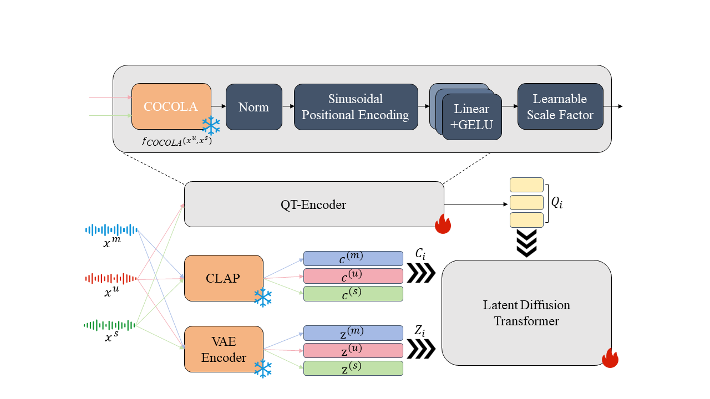
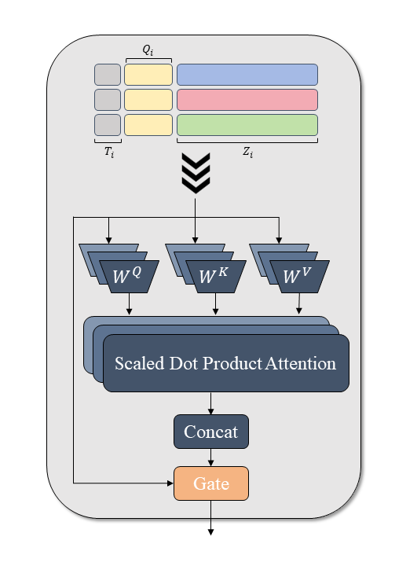

# QAG-LDM

> **Quality-Aware Gated Multi-source Latent Diffusion Model for Music Generation and Source Extraction**


---

## Table of Contents

1. [Overview](#overview)
2. [Features](#features)
3. [Installation](#installation)
4. [Model Checkpoints](#model-checkpoints)
5. [Training](#training)
6. [Inference](#inference)
7. [Quality Control](#quality-control)
8. [Reference](#reference)
9. [Citation](#citation)

---

## Overview

<p align="center">
  
  
</p>
<p align="center">
  <b>Left</b>: Overall pipeline with QT-Encoder. <b>Right</b>: Gated Self-Attention (GSA) mechanism.
</p>

QAG-LDM enhances multi-stem music generation and source extraction with quality-aware conditioning and adaptive gated modulation. The framework introduces:

- **QT-Encoder**: Converts normalized COCOLA coherence scores into learnable quality tokens via sinusoidal encoding and a two-layer MLP, prepended as prefix tokens to the latent sequence.
- **Gated Self-Attention (GSA)**: A head-specific, input-dependent gate applied to each attention head's output before projection, mitigating the attention sink phenomenon on timestep tokens.
- **Auxiliary Quality Prediction**: A masked-quality training strategy with an auxiliary regression head that ensures quality information is encoded in hidden representations.

The model supports total generation, partial generation, and source extraction within a single unified framework, trained jointly on Slakh2100, MUSDB18, and MoisesDB.

---

## Features

- **Total Generation**: Generate complete multi-track music from text prompts with quality control.
- **Source Extraction**: Extract individual sources (bass, drums, guitar, piano, etc.) from mixed audio.
- **Partial Generation**: Generate missing stems to accompany existing audio with coherence-aware conditioning.
- **Quality-Aware Inference**: Adjust the quality score parameter to control the coherence and fidelity of generated audio.
- **Flexible CFG**: Independent guidance scales for text and quality conditions.

---

## Installation

1. **Clone the repo**:

   ```bash
   git clone https://github.com/locacaca/QAG-LDM.git
   cd QAG-LDM
   ```

2. **Create environment**:

   ```bash
   conda create -n qagldm python=3.9
   conda activate qagldm
   ```

3. **Install PyTorch**:

   ```bash
   conda install pytorch==2.3.1 torchvision==0.18.1 torchaudio==2.3.1 pytorch-cuda=12.1 -c pytorch -c nvidia
   ```

4. **Install dependencies**:

   ```bash
   pip install -r requirements.txt
   ```

---

## Model Checkpoints

| Component | Description |
|-----------|-------------|
| AutoEncoder | VAE encoder/decoder (C=64, downsampling ratio 2048) |
| LDM (DiT) | 24-layer diffusion transformer with GSA (includes AE weights) |
| CLAP | `music_audioset_epoch_15_esc_90.14.pt` from [LAION-CLAP](https://github.com/LAION-AI/CLAP) |
| COCOLA | Frozen `COCOLA-HP-v1` for quality score computation |

Place checkpoints under `ckps/` or specify paths in config files.

---

## Training

### 1. Download Datasets

- [Slakh2100](https://zenodo.org/records/4599666)
- [MUSDB18](https://zenodo.org/records/3338373)
- [MoisesDB](https://music.ai/research/)

### 2. Train AutoEncoder

```bash
bash scripts/train_ae.sh
```

After training, unwrap the checkpoint:

```bash
bash scripts/unwrap_ae_script.sh
```

### 3. Data Preparation

Encode audio into latent representations and compute CLAP/COCOLA features:

```bash
bash scripts/pre_encode_script.sh
```

The pre-encoded data structure:

```
pre_extracted_latents/
├── slakh2100/
│   ├── train/
│   │   ├── track00000/
│   │   │   ├── mix.npy
│   │   │   ├── mix_clap.npy
│   │   │   ├── comb0/
│   │   │   │   ├── src.npy
│   │   │   │   ├── src_clap.npy
│   │   │   │   ├── submix.npy
│   │   │   │   ├── submix_clap.npy
│   │   │   │   └── comb_info.json  (includes cocola_score)
│   │   │   ...
│   ├── valid/...
│   ├── test/...
├── musdb18/...
├── moisesdb/...
```

### 4. Train Latent Diffusion Model

```bash
bash scripts/train_dit.sh
```

Key training hyperparameters (see `configs/trainer/dit.yaml`):

| Parameter | Value |
|-----------|-------|
| Optimizer | AdamW (lr=5e-5, betas=(0.9, 0.999), wd=0.001) |
| Scheduler | InverseLR (inv_gamma=1e6, power=0.5) |
| CFG dropout | 0.4 |
| Timestep dropout | 0.75 |
| Quality mask prob | 0.15 |
| Quality aux loss weight | 0.1 |
| Gradient clip | 1.0 |
| EMA | enabled |

After training, unwrap the DiT checkpoint:

```bash
bash scripts/unwrap_dit_script.sh
```

---

## Inference

All inference tasks support the `--quality_score` parameter (range 0.0-1.0, recommended 0.8).

### Total Generation

```bash
python infer.py \
    --config-name dit \
    +task=total_gen \
    ckpt_path=PATH_TO_CHECKPOINT \
    +gen_audio_dur=12.8 \
    "+text_prompt='Lo-fi hip hop beat with mellow jazzy chords'" \
    +num_steps=250 \
    +cfg_scale=2.0 \
    +quality_score=0.8 \
    +output_dir=./outputs/
```

### Source Extraction

```bash
python infer.py \
    --config-name dit \
    +task=source_extract \
    ckpt_path=PATH_TO_CHECKPOINT \
    +given_wav_path=path/to/mixed_audio.wav \
    "+text_prompt='The sound of vocals'" \
    +num_steps=250 \
    +cfg_scale=2.0 \
    +quality_score=0.8 \
    +output_dir=./outputs/
```

### Partial Generation

```bash
python infer.py \
    --config-name dit \
    +task=partial_gen \
    ckpt_path=PATH_TO_CHECKPOINT \
    +given_wav_path=path/to/submix_audio.wav \
    "+text_prompt='Jazz piano improvisation'" \
    +num_steps=250 \
    +cfg_scale=2.0 \
    +quality_score=0.8 \
    +output_dir=./outputs/
```

---

## Quality Control

The quality score controls the coherence and fidelity of generated audio:

| Quality Score | Effect |
|---------------|--------|
| 0.2 | Lower coherence, more diverse but potentially misaligned |
| 0.5 | Moderate coherence |
| 0.8 | High coherence and fidelity (recommended) |

The quality token is derived from COCOLA scores computed on (sub-mixture, source) pairs during training. At inference, setting a higher quality score guides the model toward generating audio with stronger inter-track coordination.

To run inference without quality control (baseline mode):

```bash
python infer_no_quality.py \
    --config-name dit \
    +task=total_gen \
    ckpt_path=PATH_TO_CHECKPOINT \
    ...
```

---

## Reference

Built upon:

- [MGE-LDM](https://github.com/yoongi43/MGE-LDM) by Yunkee Chae and Kyogu Lee
- [Stable Audio Tools](https://github.com/Stability-AI/stable-audio-tools) by Stability AI
- [COCOLA](https://github.com/Pliploop/COCOLA) for coherence evaluation
- [LAION-CLAP](https://github.com/LAION-AI/CLAP) for text-audio alignment

---

[//]: # (## Citation)

[//]: # ()
[//]: # (```bibtex)

[//]: # (@article{lin2025qagldm,)

[//]: # (  title={QAG-LDM: Quality-Aware Gated Multi-source Latent Diffusion Model for Music Generation and Source Extraction},)

[//]: # (  author={Lin, Qinran and Wang, Yiqun and Zhang, Hao and Li, Yong},)

[//]: # (  year={2025})

[//]: # (})
```
